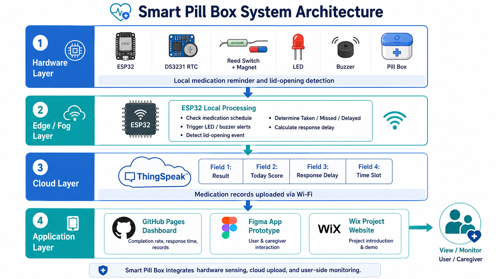
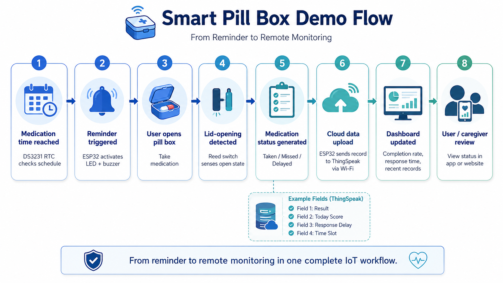
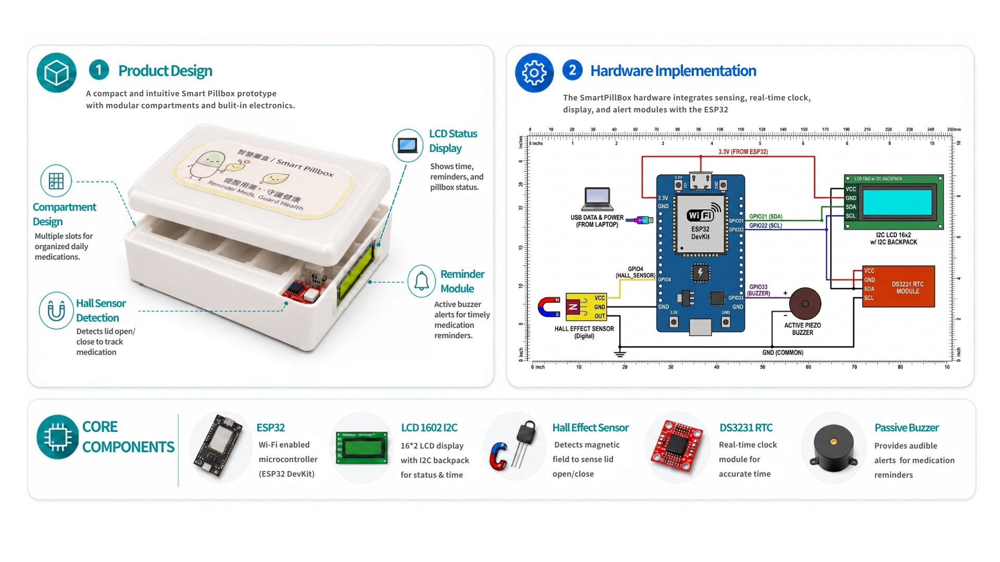
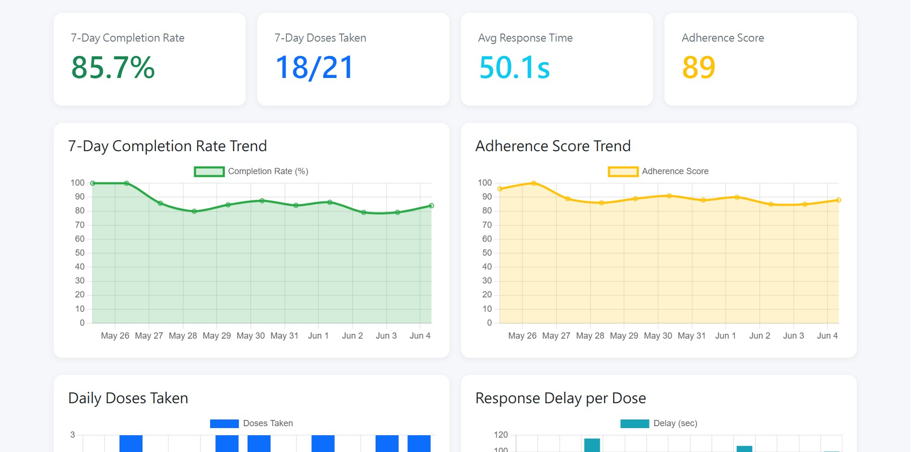
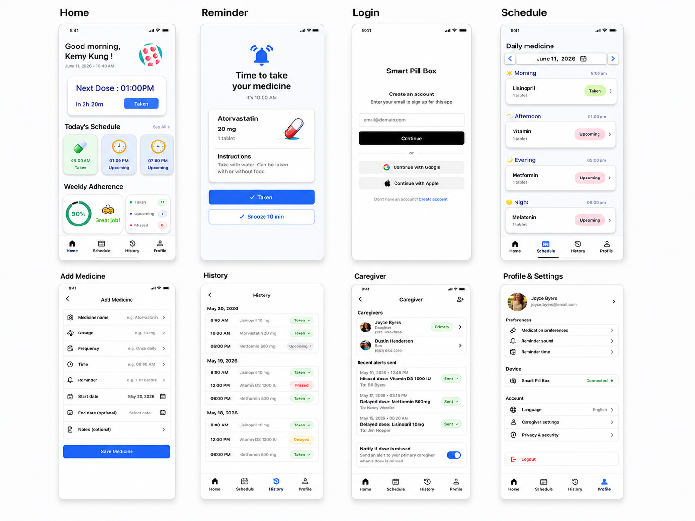
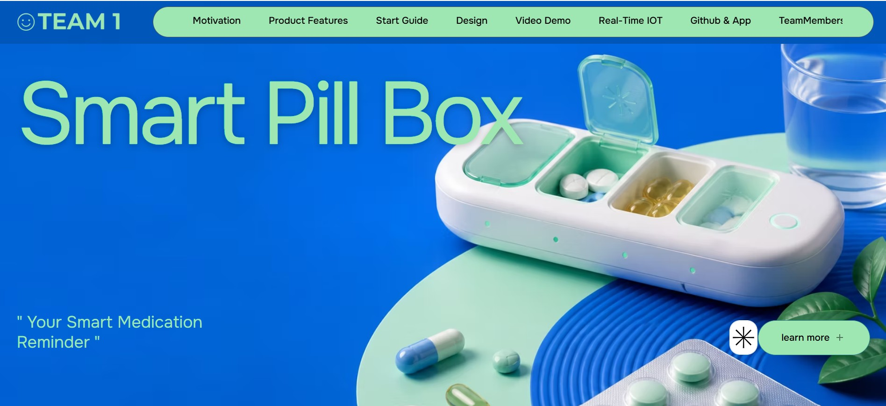

# 💊 Smart Pill Box

### IoT Medication Reminder & Remote Monitoring System

An IoT-based smart medication box designed to help users take medicine on time, record medication behavior, and support remote caregiver monitoring.

<p align="center">
  <b>Medication Reminder ｜ Lid Detection ｜ Cloud Upload ｜ Dashboard Visualization ｜ Caregiver Monitoring</b>
</p>

---

## 🔗 Project Links

| Item                    | Link                                                                                          |
| ----------------------- | --------------------------------------------------------------------------------------------- |
| 🌐 Project Website      | https://xoxowendy61.wixsite.com/my-site                                                       |
| 📊 Live Dashboard       | https://kemykung.github.io/Cloud-and-Fog-Computing-in-the-Internet-of-Things-Group-1-/        |
| 🧑‍💻 GitHub Repository | https://github.com/kemykung/Cloud-and-Fog-Computing-in-the-Internet-of-Things-Group-1-        |
| 📱 App Prototype        | https://www.figma.com/design/WrhiTSzdnIpBZy0kMUPsVT/Untitled?node-id=0-1&t=Hkhunz3Epct07fi3-1 |

---

## 📌 Project Overview

The **Smart Pill Box** is an IoT-based medication reminder system designed to improve medication adherence.

The system uses an **ESP32** as the main controller, a **DS3231 RTC module** for medication scheduling, a **reed switch** for lid-opening detection, and a **buzzer reminder** for real-time medication alerts.

When a medication event occurs, the ESP32 uploads the medication record to **ThingSpeak** through Wi-Fi. The GitHub Pages dashboard then visualizes medication completion rate, response delay, daily intake, and recent medication behavior.

This project includes:

* 📦 **Hardware Prototype** — ESP32, DS3231 RTC, reed switch, magnet, and buzzer
* ☁️ **Cloud Data Upload** — medication records uploaded to ThingSpeak
* 📊 **Dashboard** — medication adherence visualization
* 📱 **App Prototype** — user-side and caregiver-side interface design
* 🌐 **Project Website** — project introduction and demo presentation

---

## 🛠️ Technology Stack

| Layer              | Tools / Components                             |
| ------------------ | ---------------------------------------------- |
| Hardware           | ESP32, DS3231 RTC, Reed Switch, Magnet, Buzzer |
| Cloud Platform     | ThingSpeak                                     |
| Data Visualization | GitHub Pages Dashboard                         |
| App Prototype      | Figma                                          |
| Project Website    | Wix                                            |
| Documentation      | GitHub README                                  |

---

## 💡 Motivation

Medication non-adherence is a common issue, especially for elderly users or people who need to take multiple medications every day.

Traditional pillboxes and simple alarm-based reminders still have several limitations:

| Problem                      | Description                                                        |
| ---------------------------- | ------------------------------------------------------------------ |
| ⏰ Forgetting medication      | Users may forget to take medicine on time                          |
| 🔁 Repeated dosage           | Users may accidentally take the same medicine again                |
| 👨‍👩‍👧 Lack of remote care | Family members cannot remotely confirm medication status           |
| 📝 No medication records     | Traditional pillboxes do not store usage history                   |
| 📉 Hard to track behavior    | Long-term medication behavior is difficult to analyze without data |

Therefore, this project aims to build a **low-cost IoT medication reminder system** that not only reminds users, but also records medication behavior and supports remote monitoring.

---

## ✅ Proposed Solution

The Smart Pill Box integrates **hardware sensing**, **edge processing**, **cloud storage**, and **user-side visualization**.

Main functions include:

* ⏱️ Scheduled medication reminder using **DS3231 RTC**
* 🔔 Buzzer alert when medication time arrives
* 📦 Lid-opening detection using **reed switch + magnet**
* ⚙️ Local event processing on **ESP32**
* ☁️ Medication record upload to **ThingSpeak**
* 📊 Dashboard visualization for adherence monitoring
* 📱 App prototype for medication management and caregiver monitoring

---

## 🧩 System Architecture



The system is divided into four layers: **Hardware Layer**, **Edge / Fog Layer**, **Cloud Layer**, and **Application Layer**.

### 📦 Hardware Layer

| Component            | Purpose                                    |
| -------------------- | ------------------------------------------ |
| ESP32                | Main controller and Wi-Fi communication    |
| DS3231 RTC           | Tracks real-time medication schedule       |
| Reed Switch + Magnet | Detects whether the pill box lid is opened |
| Buzzer               | Provides audio medication reminder         |
| Pill Box             | Physical medication container              |

### ⚙️ Edge / Fog Layer

The ESP32 performs local decision-making before uploading data to the cloud.

Main tasks include:

* Checking the current time from the RTC module
* Activating buzzer reminders
* Detecting whether the pill box is opened
* Determining medication status: **Taken**, **Missed**, or **Delayed**
* Calculating response delay
* Uploading medication records to ThingSpeak

### ☁️ Cloud Layer

ThingSpeak is used as the cloud platform for storing medication records.

| Field   | Meaning                    | Example                                                    |
| ------- | -------------------------- | ---------------------------------------------------------- |
| Field 1 | Medication result          | `1 = Taken`, `0 = Missed`                                  |
| Field 2 | Daily completed dose count | `0–3`                                                      |
| Field 3 | Response delay             | Seconds                                                    |
| Field 4 | Medication time slot       | `1 = Morning`, `2 = Afternoon`, `3 = Evening`, `4 = Night` |

### 📱 Application Layer

| Interface                 | Role                                          |
| ------------------------- | --------------------------------------------- |
| 🌐 Wix Website            | Project landing page and product introduction |
| 📊 GitHub Pages Dashboard | Medication data visualization                 |
| 📱 Figma App Prototype    | User-side medication management interface     |
| 🧑‍💻 GitHub Repository   | Technical documentation and source code       |

---

## 🔄 System Workflow



The workflow shows how the system connects medication reminders, lid-opening detection, cloud data upload, and user-side monitoring.

| Status      | Condition                                                       |
| ----------- | --------------------------------------------------------------- |
| ✅ Taken     | User opens the pill box within the expected time window         |
| ❌ Missed    | User does not open the pill box within the expected time window |
| 🟡 Delayed  | User opens the pill box later than expected                     |
| 🔵 Upcoming | Medication time has not arrived yet                             |

---
## 📦 Hardware Prototype



The prototype uses a **reed switch and magnet** to detect whether the pill box lid has been opened.

When the scheduled medication time arrives, the ESP32 activates the buzzer reminder. If the user opens the pill box, the system records the medication as taken and uploads the event to ThingSpeak.

### Hardware Components

| Component | Quantity | Purpose |
|---|---:|---|
| ESP32 Development Board | 1 | Main controller and Wi-Fi upload |
| Reed Switch Module | 1 | Lid-opening detection |
| Magnet | 1 | Works with reed switch |
| RTC DS3231 | 1 | Real-time medication schedule |
| Buzzer | 1 | Audio reminder |
| Breadboard | 1 | Prototype wiring |
| Jumper Wires | 1 set | Circuit connection |
| Pill Box | 1 | Medication storage |

## ☁️ Cloud Data Upload

The ESP32 uploads medication records to ThingSpeak through HTTP requests.

Example upload format:

```text
https://api.thingspeak.com/update?api_key=YOUR_WRITE_API_KEY&field1=1&field2=1&field3=35&field4=1
```

Example meaning:

| Field  | Value | Meaning                                       |
| ------ | ----: | --------------------------------------------- |
| field1 |     1 | Medication was taken                          |
| field2 |     1 | One dose completed today                      |
| field3 |    35 | User opened the box 35 seconds after reminder |
| field4 |     1 | Morning medication slot                       |

This cloud data is later used by the dashboard to calculate medication adherence indicators.

---

## 📊 Dashboard Design

The dashboard is used to visualize medication data retrieved from ThingSpeak.

| Metric | Meaning |
|---|---|
| 📈 7-Day Completion Rate | Completed doses / scheduled doses within the latest 7 days |
| 💊 7-Day Doses Taken | Number of `Taken` medication events within the latest 7 days |
| ⏱️ Avg Response Time | Average delay between reminder time and lid opening |
| ⭐ Adherence Score | Overall medication behavior score based on completion and response delay |
| 🧾 Recent Records | Latest medication events grouped by time slot and status |

The dashboard helps convert raw IoT sensor data into clear medication behavior indicators.



---

## 📱 Mobile App Prototype

The mobile app prototype demonstrates how users and caregivers can interact with the medication reminder system in a real-life scenario.

| Page                   | Function                                                       |
| ---------------------- | -------------------------------------------------------------- |
| 🔐 Login               | Account sign-in and user identity setup                        |
| 🏠 Home                | Today’s schedule, next dose, weekly adherence                  |
| 🔔 Reminder            | Medication reminder, dose information, Taken / Snooze action   |
| 📅 Medication Schedule | Daily medication list by time slot                             |
| ➕ Add Medicine         | Add medicine name, dosage, frequency, reminder time, and notes |
| 🕘 History             | View medication records: Taken, Missed, Delayed, Upcoming      |
| 👥 Caregiver           | Manage caregivers and send missed-dose alerts                  |
| ⚙️ Profile & Settings  | Reminder preferences, device connection, language, privacy     |

The app prototype connects the IoT system with actual user scenarios. ESP32 and ThingSpeak handle data collection and cloud storage, while the app presents medication status in a clear and user-friendly way.



---

## 🌐 Website Design

The Wix website works as the project landing page.

It introduces:

- 💡 Project motivation
- 💊 Smart pill box features
- 🔄 IoT system workflow
- 🎬 Demo video
- 🧑‍💻 GitHub repository
- 👥 Team members

The website helps viewers quickly understand what the project is, why it is needed, and how the system works.



---

## 🗂️ Repository Structure

```text
Cloud-and-Fog-Computing-in-the-Internet-of-Things-Group-1-
│
├── README.md
├── index.html
│
├── assets/
│   ├── system_architecture.png
│   ├── demo_flow.png
│   ├── prototype_photo.jpg
│   ├── dashboard_screenshot.png
│   ├── app_prototype.png
│   └── wix_website_screenshot.png
│
└── data/
    └── sample_thingspeak_data.csv
```

---

## 👥 Team Members & Roles

| Member | Student ID | Role | Responsibility |
| ------ | ---------- | ---- | -------------- |
| 鄭矞心 | M11451016 | Website Design | Website layout design, webpage content organization, visual presentation, and Wix page refinement |
| 龔倢 | M11451018 | Programming & Cloud Integration | Program development, ESP32 logic implementation, ThingSpeak cloud setup, data upload testing, and cloud data field organization |
| 劉芸廷 | M11451020 | GitHub & App System | GitHub structure, technical documentation, system architecture explanation, app interface logic design, medication workflow design, and function integration |
| 鄭羽喬 | M11451023 | Pill Box Design & Report | Pill box appearance design, prototype concept planning, report writing, and final report integration |
| 蕭詠蒨    | M11451033  | Circuit Soldering & Report | Circuit board soldering, hardware connection support, final report organization |

---
### 🗓️ Project Gantt Chart
This project follows a 16-week course schedule.
The timeline below shows how the Smart Pill Box project is planned and developed from topic selection to final presentation and demo.


| Task                                            | W01 | W02 | W03 | W04 | W05 | W06 | W07 | W08 | W09 | W10 | W11 | W12 | W13 | W14 | W15 | W16 |
| ----------------------------------------------- | --- | --- | --- | --- | --- | --- | --- | --- | --- | --- | --- | --- | --- | --- | --- | --- |
| Topic selection and problem definition          | 🟦  | 🟦  |     |     |     |     |     |     |     |     |     |     |     |     |     |     |
| Background research and existing project review |     | 🟦  | 🟦  | 🟦  | 🟦  |     |     |     |     |     |     |     |     |     |     |     |
| System architecture planning                    |     |     | 🟩  | 🟩  | 🟩  | 🟩  |     |     |     |     |     |     |     |     |     |     |
| Component selection and BOM preparation         |     |     |     | 🟨  | 🟨  | 🟨  | 🟨  |     |     |     |     |     |     |     |     |     |
| Midterm proposal preparation                    |     |     |     |     |     | 🟧  | 🟧  | 🟧  |     |     |     |     |     |     |     |     |
| ESP32 basic testing                             |     |     |     |     |     |     |     |     | 🟦  | 🟦  |     |     |     |     |     |     |
| RTC and reminder logic testing                  |     |     |     |     |     |     |     |     |     | 🟩  | 🟩  |     |     |     |     |     |
| Reed switch lid detection testing               |     |     |     |     |     |     |     |     |     | 🟩  | 🟩  | 🟩  |     |     |     |     |
| Buzzer reminder integration                     |     |     |     |     |     |     |     |     |     |     | 🟨  | 🟨  | 🟨  |     |     |     |
| ThingSpeak cloud data upload                    |     |     |     |     |     |     |     |     |     |     |     | 🟦  | 🟦  | 🟦  |     |     |
| GitHub Pages dashboard development              |     |     |     |     |     |     |     |     |     | 🟪  | 🟪  | 🟪  | 🟪  | 🟪  |     |     |
| Wix project website design                      |     |     |     |     |     | 🟪  | 🟪  | 🟪  | 🟪  |     |     |     |     |     |     |     |
| Figma mobile app prototype                      |     |     |     |     |     |     | 🟪  | 🟪  | 🟪  | 🟪  | 🟪  |     |     |     |     |     |
| System integration and testing                  |     |     |     |     |     |     |     |     |     |     |     |     | 🟧  | 🟧  | 🟧  |     |
| GitHub documentation and README refinement      |     |     |     |     |     |     |     | 🟦  | 🟦  | 🟦  | 🟦  | 🟦  | 🟦  | 🟦  | 🟦  |     |
| Final demo video and presentation preparation   |     |     |     |     |     |     |     |     |     |     |     |     |     | 🟥  | 🟥  | 🟥  |
| Final presentation and demo                     |     |     |     |     |     |     |     |     |     |     |     |     |     |     |     | 🟥  |

---

## 🚀 Future Work

Future improvements include:

* 🔗 Connect the physical prototype with real ThingSpeak data upload
* 👥 Add caregiver notification through mobile app, email, or cloud trigger
* 📊 Improve dashboard design for long-term medication behavior analysis
* 📦 Extend the system to support multiple medication compartments
* 🔋 Add device connection status, battery status, and Wi-Fi status

---

## 🎯 Conclusion

This project presents a low-cost IoT-based Smart Pill Box system.

By combining **ESP32**, **RTC scheduling**, **reed switch detection**, **buzzer reminder**, **ThingSpeak cloud upload**, **dashboard visualization**, **Wix project website**, and **Figma app prototype design**, the system supports not only local medication reminders but also medication behavior monitoring and remote care scenarios.

The project demonstrates a complete IoT application flow from **device sensing** to **cloud data management** and **user-centered interface design**.
